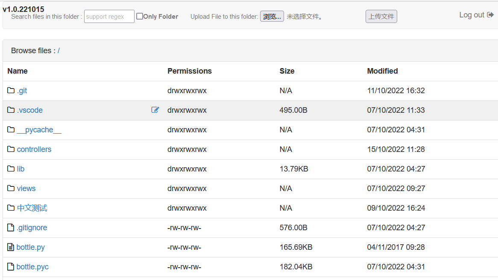

pyFileManager
=============

本工具支持Python2，网上Python3的类似工具比较多，但是没有支持Python2的，所以基于 pyFileManager 进行了代码修改 ，主要增加如下功能：

1. 支持文件上传，支持在目录中搜索，获取文件夹大小

2. 支持多语言编码，支持中文路径和文件名

   相关截图如下

    

默认管理员帐号为 test2/test2 （读写），普通帐号为test/test（只读），可在  `lib\config\config.py`中配置 root_path 为浏览根目录，如果需要大小更小，可删除 views\static\fonts 下除 fontawesome-webfont.woff2 以外的其他文件

#### 用法:

1. 确保安装了Python2 环境
2. 检查配置文件`lib\config\config.py` 中的参数
3. 控制台跳转到本程序目录，运行 `python ./server.py`
4. 打开浏览器，访问 http://127.0.0.1:8083（默认）

#### 功能:

- 支持代理设置
- 显示权限
- 下载，重命名，删除文件
- 上传文件
- 目录中搜索文件
- 获取文件夹大小
- 支持中文


#### 配置NGINX :

- 修改 `lib\config\config.py`  中的"app_dir" 为指定目录
- 用此目录在 NGiNX 进行如下配置:

```
location /directory {
    proxy_pass http://127.0.0.1:8083;
}
```